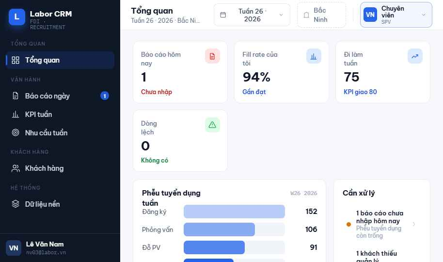
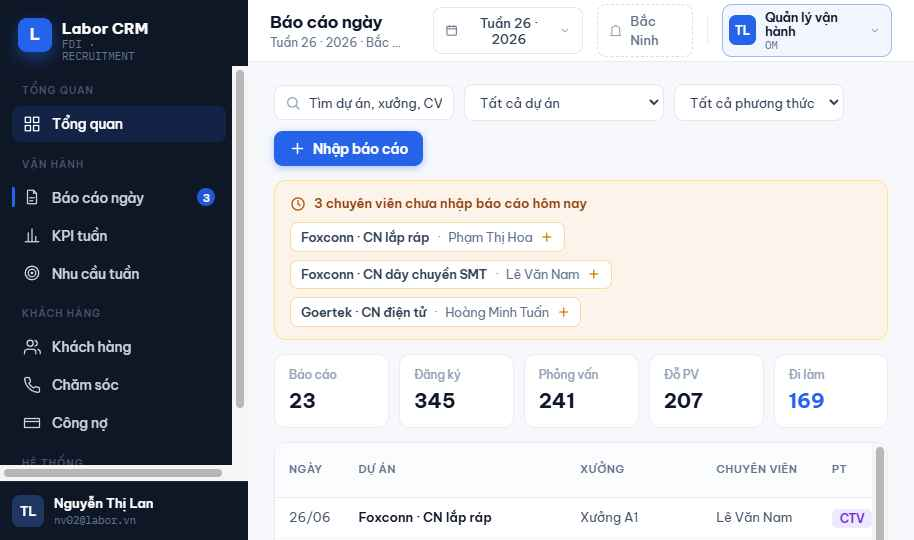
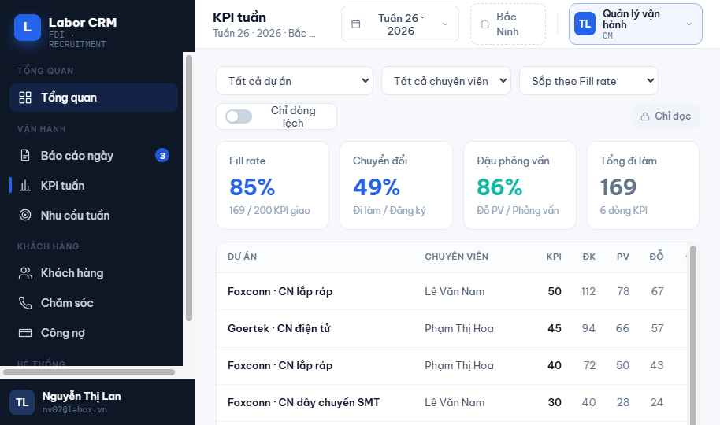
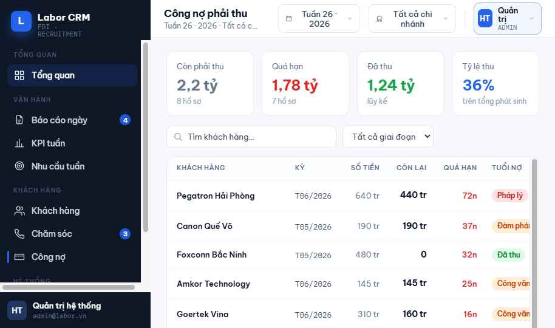
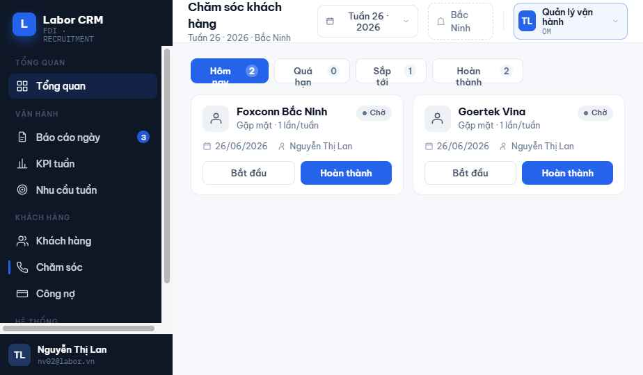
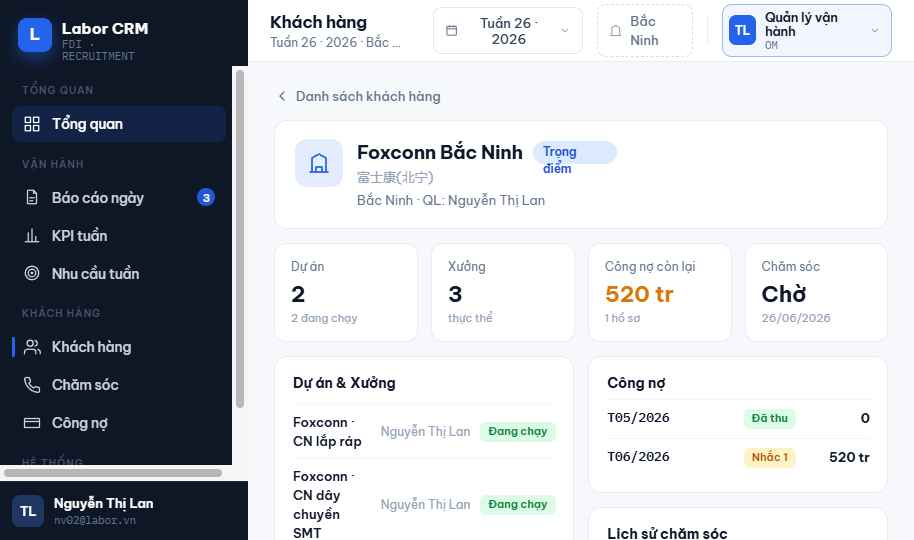

# Thành công — Hệ thống quản lý điều hành (Labor CRM)

> CRM tuyển dụng / cung ứng lao động cho nhà máy FDI (Goertek, Foxconn, Luxshare…), vận hành theo chi nhánh tỉnh — xây trên **Google Apps Script + Google Sheets** (không cần server, không tốn hạ tầng).

Lõi nghiệp vụ: **phễu tuyển dụng** (Đăng ký → Phỏng vấn → Đỗ PV → Đi làm) + **KPI fill theo tuần**, kèm khách hàng, chính sách giá, **chăm sóc khách hàng** theo lịch, và **công nợ** (aging + truy thu). Phân quyền 3 tầng theo vai trò × chi nhánh × người phụ trách.

---

## ✨ Tính năng chính

- **Dashboard** theo vai trò: fill rate, phễu tuyển dụng, tuổi nợ, việc cần xử lý — theo tuần.
- **Báo cáo ngày**: nhập phễu tuyển dụng, tự tính tuần ISO, tự roll-up KPI.
- **KPI tuần** (chỉ đọc): FULL OUTER JOIN giữa nhu cầu giao & kết quả thực tế.
- **Nhu cầu tuần**: nhập KPI giao theo dự án × chuyên viên (lưới hàng loạt).
- **Khách hàng 360**: dự án, xưởng, chính sách, công nợ, lịch sử chăm sóc trong 1 màn.
- **Chăm sóc KH**: lịch theo tần suất (mốc 1 & 15), tự sinh lượt kế tiếp, quá hạn tự đánh dấu.
- **Công nợ**: aging tự động, ghi nhận thu, workflow truy thu (Mở → Một phần → Pháp lý → Tất toán).
- **Quản trị**: người dùng, danh mục enum song ngữ (vi/中), chi nhánh, hàng đợi chuẩn hóa tên, nhật ký kiểm toán.
- **Song ngữ** Tiếng Việt / 中文 · **PWA** (thêm vào màn hình chính) · responsive desktop + mobile.

## 🖼️ Ảnh màn hình

| Dashboard | Báo cáo ngày | KPI tuần |
|---|---|---|
|  |  |  |

| Công nợ | Chăm sóc | Khách hàng 360 |
|---|---|---|
|  |  |  |

---

## 🧱 Kiến trúc

| Thành phần | Công nghệ |
|---|---|
| Cơ sở dữ liệu | **Google Sheets** — mỗi entity 1 sheet, khóa ngoại lưu `name`/ID |
| Backend | **Apps Script (V8)** — "ORM" tối giản trên Sheets, cache đọc theo-request |
| Web App | **HtmlService** (iframe sandbox), gọi backend qua `google.script.run` |
| Frontend | Vanilla JS trong `Ui.html` (state-routing, không dùng URL hash) |
| Tự động hóa | **Time-driven trigger** (~2h sáng: tính lại KPI, re-age công nợ, quét chăm sóc, backup) |
| Phân quyền | RBAC 3 tầng: ma trận module × vai trò + phạm vi chi nhánh + thu hẹp theo người phụ trách |

### Cấu trúc mã

| File | Vai trò |
|---|---|
| `00_Config.gs` | SCHEMA mọi sheet + seed (enum, ngưỡng aging, cadence, alias, chi nhánh) |
| `01_Db.gs` | ORM: đọc/ghi theo object, sinh `name`, query/upsert/bulk, **cache + chốt ghi nội bộ** |
| `02_Setup.gs` | `setupAll()` tạo toàn bộ sheet + seed; `seedDemo()` dữ liệu mẫu |
| `03_Kpi.gs` | ISO week, FULL OUTER roll-up KPI + `runKpiTests()` (T1–T5) |
| `04_Finance.gs` | Công nợ 2 trục (aging + thu) + `runReceivableTests()` (D1–D4) |
| `05_Crm.gs` | Cadence chăm sóc, mark overdue, sinh lượt kế |
| `06_Menu.gs` | Menu điều khiển + cài time-trigger tự động |
| `07_Api.gs` | Web App: `doGet` + API (bootstrap, list/get/save, dashboard, lookup, hành động đặc thù) |
| `08_Meta.gs` | Metadata module (nhãn song ngữ, cột list, field form) điều khiển UI tổng quát |
| `09_Rbac.gs` | Ma trận quyền + scope OM/SPV + chống IDOR (mặc định DENY) |
| `10_Workflow.gs` | Workflow công nợ + chăm sóc |
| `11_Jobs.gs` | Backup spreadsheet hằng ngày (Drive) |
| `99_Migration.gs` | Migration dữ liệu thật (đối soát Σ đi làm / Σ công nợ) |
| `App.html` · `Styles.html` · `Ui.html` | Khung SPA · CSS · toàn bộ frontend |

📚 Tài liệu đặc tả đầy đủ trong [`docs/`](docs/): SRS, mô hình dữ liệu, UX/UI, blueprint, trạng thái triển khai, mockup thiết kế.

---

## 🚀 Cài đặt & triển khai

### 1. Tạo dự án
- Tạo **1 Google Sheet trống** → **Tiện ích mở rộng → Apps Script**.
- Tạo các file `.gs` (00→11, 99) và 3 file HTML (`App`, `Styles`, `Ui` — gõ tên **không kèm** `.html`), dán nội dung. Sửa `appsscript.json` cho khớp.
  - *Hoặc* dùng [`clasp`](https://github.com/google/clasp) / `node push.js` để đẩy tự động (xem [CLASP.md](CLASP.md)).

### 2. Khởi tạo dữ liệu
Trong editor Apps Script, chạy theo thứ tự:
1. **`setupAll`** — tạo toàn bộ sheet + seed nền (cấp quyền lần đầu). Tự ghi email người chạy vào `ADMIN_EMAILS` (admin đầu tiên).
2. *(Tùy chọn)* **`seedDemo`** — dữ liệu mẫu để test nhanh, **hoặc** **`runMigration`** — nạp dữ liệu thật.
3. **`runKpiTests`** + **`runReceivableTests`** — xem Log (Ctrl+Enter) phải **PASS** hết.
4. F5 lại Sheet → menu **⚙️ Thành công** xuất hiện.

### 3. Triển khai Web App
1. **Deploy → New deployment → Web app**.
2. *Execute as:* **Me** · *Who has access:* tùy nội bộ (Anyone / trong tổ chức).
3. Mở **link `/exec`** (KHÔNG xem được bằng nút ▶ Run trong editor).
4. ⚠️ **Mỗi lần sửa code phải tạo version mới**: Deploy → Manage deployments → ✏️ → *Version: New version* → Deploy. Khi đang phát triển dùng link **`/dev`** (luôn chạy code mới nhất).

### 4. Phân quyền người dùng
- Mở app → **Cấu hình → Người dùng** → **Thêm người dùng**: nhập email Google, chọn vai trò, gắn **Nhân sự** (tự điền chi nhánh).
- Admin đầu tiên (email chạy `setupAll`) được tự thêm khi mở app.

---

## 👥 Vai trò & quyền

| Mã | Vai trò | Phạm vi |
|---|---|---|
| `ADMIN` | System Manager | Toàn bộ + quản trị người dùng/danh mục |
| `BOD` | Ban giám đốc | Đọc toàn bộ |
| `BM` | Quản lý chi nhánh | Đọc/ghi trong **chi nhánh** mình |
| `OM` | Quản lý vận hành | Dự án mình phụ trách + chuyên viên dưới quyền |
| `SPV` | Chuyên viên | Báo cáo của chính mình (sửa trong cửa sổ T+1) |

*Mặc định DENY: ai chưa được cấp quyền → không vào được. Admin xác định qua sheet `Users` hoặc script property `ADMIN_EMAILS`.*

## 📅 Quy trình tuần điển hình

1. Đầu tuần — **Nhu cầu tuần**: nhập KPI giao theo dự án × chuyên viên.
2. Hằng ngày — **Báo cáo ngày**: nhập phễu tuyển dụng → KPI tự roll-up.
3. Theo dõi — **Dashboard / KPI tuần**: fill rate, chuyển đổi, lệch chuyên viên.
4. **Chăm sóc KH** theo lịch · **Công nợ**: ghi nhận thu, truy thu.
5. ~2h sáng — trigger tự tính lại KPI, re-age công nợ, quét chăm sóc quá hạn, backup.

---

## 🔧 Dành cho lập trình viên

- **Đẩy code lên Apps Script**: `node push.js` (tin cậy, PUT thẳng Apps Script API) hoặc `clasp push`. Token clasp hết hạn ~1h → `node refresh.js`. Xem [CLASP.md](CLASP.md).
- **Đẩy code lên GitHub**: `git add -A && git commit -m "..." && git push`.
- ORM có **chốt ghi nội bộ** (`ormAllow_`/`assertOrm_`): mọi hàm ghi mới phải đi qua `userContext_()` hoặc tự gọi `ormAllow_()`, nếu không sẽ bị chặn ("Thao tác dữ liệu nội bộ").

## ⚠️ Lưu ý dữ liệu

Repo này chứa dữ liệu vận hành thật trong `99_Migration.gs` và ảnh màn hình (tên nhân sự, khách hàng, công nợ). Nếu fork/tái sử dụng cho mục đích khác, hãy thay bằng dữ liệu ẩn danh.
